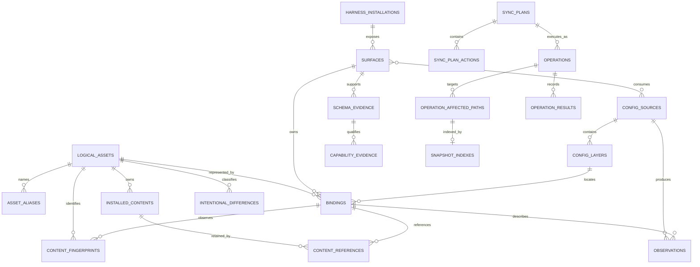

# ADR-0002: SQLite Metadata Schema and Operation Journal

- **Status:** Accepted
- **Date:** 2026-07-16
- **Decision owners:** AgentMindStudio maintainers
- **Gate:** TG-005
- **Migration:** `0001_metadata.sql`

## Context

AgentMindStudio needs durable identity, inventory, capability, audit, and recovery relationships that cannot be reconstructed safely from one current client file. At the same time, Nexus decisions ND-004 and ND-007 require live client files to remain authoritative and require snapshot bytes to remain on the filesystem. SQLite must therefore be a metadata and operation journal, not a canonical configuration mirror or secret store.

The first schema also has to represent the adapter vocabulary accepted by ADR-0001 without implying that production client adapters exist. TG-003 and TG-004 still own client source evidence and fixtures; migration `0001` creates storage capacity for their eventual observations but does not pre-approve any client capability.

## Decision

Use Bun's built-in `bun:sqlite` driver with a checked, ordered migration runner. Migration `0001` creates normalized tables for installation/surface topology, sources and layers, logical identity and bindings, observation evidence, plans, operation audit, recovery, and filesystem snapshot indexes.

### Entity relationships



### Storage boundaries

SQLite stores:

- installation, surface, resolved-source, and precedence-layer metadata;
- logical asset identities, aliases, binding relationships, and SHA-256 fingerprints;
- schema/capability evidence, parse status, safe error codes, and intentional-difference classifications;
- reviewed plan structure, operation state, affected paths, before/after hashes, result codes, and snapshot indexes;
- migration version, migration name, source checksum, and application timestamp.

SQLite does not store:

- client source bytes or normalized raw configuration documents;
- environment values, header values, tokens, passwords, or resolved credential material;
- snapshot/archive bytes;
- arbitrary process output, diagnostics, or free-form failure payloads.

Credential metadata is limited to whether a binding exists and its reference category. Snapshot rows store an opaque storage key, filesystem-relative path, hash, and byte length; the bytes belong under the application snapshot root.

### Shared-content deletion guard

`content_references` records which bindings retain an installed content directory. A deletion-check view exposes reference counts, and a trigger rejects deletion while any retained reference exists. The foreign-key relationship remains `RESTRICT` as a second structural guard. A future uninstall service must review the check, remove only explicitly selected references, and then attempt deletion.

### Migration integrity

The migration runner creates `schema_migrations` before applying versioned sources. Each applied row records the migration name and SHA-256 of its SQL source. Re-running the migration is idempotent; changing an already applied migration causes startup to fail instead of silently accepting schema drift. Every migration executes inside a SQLite transaction with foreign keys enabled.

## Operation and crash-recovery states

The journal uses these normal transitions:

```text
planned -> confirmed -> snapshotting -> applying -> verifying -> succeeded
```

Each non-terminal state may transition to `failed` when a safe retry/recovery path is not available. A startup scan treats `snapshotting`, `applying`, `verifying`, and `recovering` as interrupted side-effect states:

```text
snapshotting | applying | verifying | recovering
    -> recovery_required
    -> recovering
    -> recovered | partial_recovery | failed
```

`planned` and `confirmed` are not automatically marked for recovery because no filesystem side effect has begun. Terminal states cannot transition. `recovery_attempts` increments when recovery starts, and interruption uses the stable code `PROCESS_INTERRUPTED`; raw exception or file content is not stored.

The implemented state machine validates transitions before updating SQLite. Migration smoke tests verify forward/recovery transitions and restart classification. This is operation-journal infrastructure only: TG-006 now verifies the threat/control contract, while the read-only vertical-slice exit and mapped capability tests still block production mutation behavior.

## Alternatives rejected

### Store normalized configuration documents in SQLite

Rejected because arbitrary documents can contain credentials and would turn SQLite into a stale competing source of truth.

### Store snapshot bytes as SQLite BLOBs

Rejected by ND-007. Filesystem snapshots are independently inspectable, retainable, and restorable; SQLite only indexes them.

### One denormalized inventory JSON column

Rejected because identity, alias, shared-content, capability, and recovery reference checks would become application-only conventions with weak integrity and difficult migrations.

### Infer recovery only from filesystem snapshots

Rejected because a crash needs durable operation intent, state, target ordering, hashes, and result history to distinguish safe resume, restore, and partial recovery.

## Consequences

### Positive

- Foreign keys and strict tables preserve identity and audit relationships.
- Client credentials and snapshot content remain outside the metadata database.
- Shared content cannot be deleted while a retained binding references it.
- Interrupted side-effect states can be identified deterministically at startup.
- Migration drift is detected by a committed SQL checksum.

### Costs and limitations

- The normalized schema is more verbose than a document store and requires explicit repository queries.
- Schema checks prevent unsafe column design but cannot sanitize arbitrary strings by themselves; persistence APIs must continue to accept bounded, classified metadata only.
- Snapshot file creation, retention, restore, atomic writes, and recovery execution are not implemented by this ADR; they remain Phase 2 work gated by the TG-006 capability-entry tests.
- Profiles are not included in migration `0001`; adding them later requires a new migration if the post-MVP need is validated.

## Verification

- [`tests/persistence/migration.test.ts`](../../tests/persistence/migration.test.ts) verifies clean migration, idempotence, representative metadata close/reopen, transaction rollback, absence of raw credential/snapshot-content columns, and retained-content deletion checks.
- [`tests/persistence/operation-journal.test.ts`](../../tests/persistence/operation-journal.test.ts) verifies valid/invalid transitions and interrupted-state recovery classification.
- [`scripts/verify-packaged.ts`](../../scripts/verify-packaged.ts) launches the ElectroBun Windows dev bundle with isolated application data and verifies migration `0001` from the packaged runtime.
- `bun run check`, `bun run build`, and `bun run verify:packaged` pass on the TG-001 Windows/Bun/ElectroBun version line.

## Invalidation

Revisit this ADR and reopen TG-005 if normalized identity, audit, recovery, profile, or deletion-safety requirements cannot be represented without unsafe ad hoc fields; if SQLite or the application runtime is replaced; or if raw credential/snapshot content becomes a proposed persistence requirement.

