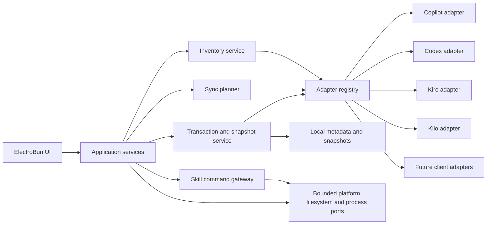
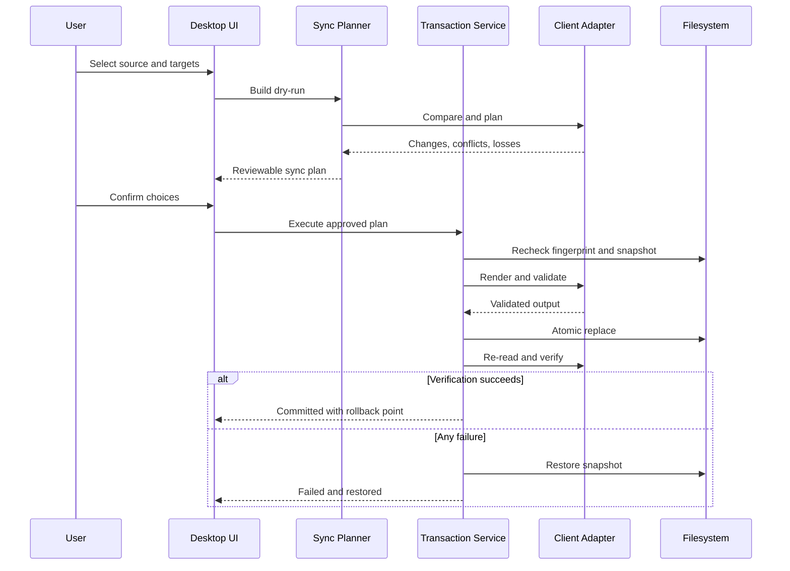

# AgentMindStudio — Technical Baseline

**Baseline date:** 2026-07-15  
**Application implemented state:** Foundation and read contracts only. The repository now contains an ElectroBun `1.18.1` production scaffold, Windows-first application-path/bounded-filesystem/process ports, SQLite migration `0001`, an operation/crash-recovery journal, sanitized client source evidence and fixture contracts, and repeatable tests. No production client adapter, parser, inventory repository/service, UI, snapshot writer, atomic mutation, or skills gateway is implemented.

**Authority:** This technical baseline inherits product intent from the [Project Nexus](../../nexus/README.md).

**Implementation readiness:** Gate status and evidence are owned by [agentmindstudio.technical-gates.md](agentmindstudio.technical-gates.md). TG-001 permitted the implemented ElectroBun scaffold and Windows platform-port foundation. TG-002 approves adapter contract `1.0.0`; TG-003 verifies user/global surface source rules; TG-004 supplies the parser/golden-test fixture contract. Client-specific read adapter implementation is ready, but no production adapter exists and no gate authorizes writes. TG-005 verifies the metadata schema and operation journal described by [ADR-0002](../../adr/ADR-0002-sqlite-metadata-schema.md). TG-006 now verifies the [security threat/control contract](agentmindstudio.threat-model.md); the read-only vertical-slice exit still blocks Phase 2, mapped future security tests still gate individual mutation capabilities, and TG-007 still blocks production UI flows.

### Verified foundation boundary

- `src/application/ports/` owns portable contracts for application paths, bounded filesystem access, and argument-array process execution.
- `src/infrastructure/platform/windows/` implements those contracts using Windows/Bun primitives without introducing harness-specific behavior.
- `src/infrastructure/persistence/sqlite/` owns the checksummed migration runner, metadata database lifecycle, and operation journal.
- `src/domain/operations/` owns the runtime-independent operation-state transition rules.
- The current ElectroBun entrypoint composes application-data initialization, migration, and clean shutdown only. Production windows/navigation remain TG-007 work.
- No source under `src/` discovers, parses, normalizes, or writes a client configuration.

## 1. Architecture objective

Keep client-specific knowledge at the boundary. The core application should reason about normalized assets, scopes, compatibility, plans, and transactions without knowing whether the target file is JSONC, TOML, YAML, Markdown, or a directory tree.



## 2. Proposed component boundaries

### Desktop shell and UI

Responsibilities:

- Window lifecycle, navigation, native dialogs, and update UI.
- Dashboard, inventory, client detail, diff, sync plan, history, restore, and settings screens.
- Use Google Stitch artifacts only to explore and approve flows; implement maintained production UI as owned shadcn/ui-based components.
- Expose instruction/rule inventory and diff as read-only views in MVP, with no mutation action or Raw Config write path.
- No direct filesystem mutation from presentation components.

### Application services

Responsibilities:

- Orchestrate use cases and authorization prompts.
- Convert adapter outputs into UI view models.
- Enforce read-only mode and confirmation requirements.

### Adapter registry

Responsibilities:

- Select an adapter by client identity and version.
- Declare read/write capabilities per artifact type and scope.
- Expose verification range and migration rules.
- Block writes when the adapter cannot safely parse, preserve, validate, or round-trip the observed configuration shape.
- Declare harness surfaces and the resolved config sources consumed by each surface; deduplicate identical resolved paths without collapsing surface capabilities.
- Register Copilot CLI and Copilot VS Code as distinct MVP surfaces with separate user/global sources and capability matrices.

### Platform ports

Responsibilities:

- Resolve global configuration roots without leaking Windows path assumptions into the domain.
- Provide argument-safe process execution, filesystem locking, atomic replacement, and optional credential-store access.
- Implement Windows first while keeping contracts implementable for macOS later.
- Never provide a recursive drive or project scanner.

### Inventory service

Responsibilities:

- Detect installations and configuration roots.
- Parse layers without mutating them.
- Normalize artifacts and compute logical identity candidates.
- Report shadowing, malformed sources, duplicate bindings, and unsupported fields.
- Build a cross-client coverage matrix that distinguishes missing artifacts from intentionally different client bindings.

### Sync planner

Responsibilities:

- Compare one logical asset with target bindings.
- Ask adapters for conversions and validation.
- Produce field-level operations, warnings, conflicts, and restart requirements.
- Produce no side effects.
- Preserve target credential overrides unless the user explicitly selects a credential replacement operation.

### Transaction and snapshot service

Responsibilities:

- Re-check fingerprints immediately before write.
- Acquire locks where possible.
- Snapshot every affected source.
- Write temporary outputs, validate, and atomically replace.
- Re-read through adapters and restore on failure.

### Skill command gateway

Responsibilities:

- Map UI workflows to supported `find`, `list`, `add`, `use`, `update`, `remove`, and `init` operations.
- Resolve source metadata.
- Stage downloads outside active client directories.
- Inspect content and risks.
- Invoke `skills@1.5.17` with `npm exec --yes --package=skills@1.5.17 -- skills ...` through a stable interface without coupling the UI to CLI text output.
- Verify exact binary version, output shape, and resulting filesystem state; exit code alone is not a success signal.
- Isolate staging `HOME`, `USERPROFILE`, `CODEX_HOME`, working directory, and npm cache for mutating CLI operations.
- Map timeouts, spawn failures, version mismatch, network errors, unparsable output, contract change, and unexpected writes to stable domain errors.
- Promote verified content to the selected destination transactionally.

### Metadata and snapshot store

Implemented foundation split:

- SQLite migration `0001` for installations/surfaces, sources/layers, logical identities, aliases, bindings, fingerprints, capability/schema evidence, observations, intentional differences, plans, operation history/recovery, affected paths, results, and snapshot indexes.
- A resolved filesystem snapshot root is initialized by the scaffold, but snapshot writing, retention, restore, and archive bytes remain unimplemented Phase 2 work.
- Secret values excluded from both unless a future dedicated secure-store feature is approved.

SQLite is not a CRUD mirror of client configuration. Live client files remain authoritative:

- **Metadata** records where an artifact was observed, which adapter read it, its hash, client coverage, and last validation result.
- **Audit** records an explicit AMS operation, affected paths, before/after hashes, outcome, and snapshot link so the operation can be explained or reversed.
- **Profile data** is an optional post-MVP named selection of logical assets for reuse; it does not automatically enforce values onto clients.
- **Relationship data** records aliases, provenance, bindings, intentional differences, and shared-content references that cannot be reconstructed reliably from current file bytes alone.
- **Operation state** records planned, confirmed, snapshotting, applying, verifying, terminal, and recovery transitions so a crash can be diagnosed. Executing recovery remains Phase 2 work.

## 3. Approved adapter contract

TG-002 accepted [ADR-0001](../../adr/ADR-0001-adapter-capability-contract.md) and contract version `1.0.0` in [`docs/spikes/adapter-contract/`](../../spikes/adapter-contract/). The contract compiles with Codex and Kilo proof adapters through one condition-free registry. TG-003 and TG-004 now provide the verified [surface evidence](../../spikes/client-surface-config/README.md) and [`fixtures/clients/`](../../../fixtures/clients/) contract required to begin production read adapters. No parser/read adapter has yet been implemented, and fixture preservation cases do not authorize writes.

An adapter provides behavior equivalent to:

```text
descriptor: AdapterDescriptor
capabilities(): CapabilityMatrix
discover(snapshot): ConfigSource[]
read(sourceDocument): ParsedSource
normalize(parsedLayer): Artifact[]
compare(logicalAsset, target): CompatibilityResult
planWrite(logicalAsset, target, choices): PlannedChange[]
render(plannedChanges, originalBytes): RenderedOutput
validate(renderedOutput, target): ValidationResult
postWriteCheck(expected, observed): VerificationResult
reloadGuidance(target): ReloadInstruction
```

Required guarantees:

- `discover`, `read`, `normalize`, `compare`, and `planWrite` are side-effect free; core supplies immutable environment/source observations.
- `render` preserves unknown fields and source formatting when the parser supports it.
- Every write capability is explicit by surface, artifact type, user/global scope, schema evidence, and verified client version.
- Adapters return candidate bytes and verification results; the core transaction service owns snapshots, external-change rechecks, filesystem writes, audit, and recovery.
- Instruction capability rows are read-only in MVP and cannot declare mutation operations.
- Adapter errors are structured; raw secret-bearing source is not included in generic logs.

## 4. Proposed normalized model

This conceptual model is now represented by the normalized tables in [migration `0001`](../../../src/infrastructure/persistence/sqlite/migrations/0001_metadata.sql) and governed by [ADR-0002](../../adr/ADR-0002-sqlite-metadata-schema.md). The model remains broader than implemented application services: the schema can persist these relationships, but client discovery and inventory repositories do not yet populate them.

### ClientInstallation

- `id`
- `clientKind`
- `harnessKind`
- `surfaceKind`
- `displayName`
- `version`
- `versionSource`
- `installationPath`
- `status`
- `adapterId`
- `adapterVerificationRange`

### ConfigLayer

- `id`
- `clientInstallationId`
- `scope`: managed, user, runtime, plugin
- `artifactKinds`
- `path`
- `format`
- `precedence`
- `writable`
- `ownership`
- `fingerprint`
- `parseStatus`

### LogicalAsset

- `id`
- `kind`: mcp-server, skill, instruction
- `canonicalName`
- `identityFingerprint`: endpoint evidence for MCP or provenance/content evidence for skills and instructions
- `aliases`
- `portableFields`
- `clientExtensions`
- `provenance`
- `profileMembership`

### ArtifactBinding

- `logicalAssetId`
- `clientInstallationId`
- `configLayerId`
- `nativeIdentity`
- `nativeFields`
- `credentialBinding`: client-specific environment/header/profile references, excluded from structural drift by default
- `effectiveState`
- `compatibilityState`
- `lastObservedFingerprint`
- `differenceIntent`: unknown, intentional, pending-review

### DriftRelation

- `leftBindingId`
- `rightBindingId`
- `classification`: missing-binding, structural-difference, version-drift, name-collision, linked-alias, credential-binding-difference, unsupported-field
- `semanticDiff`
- `userResolution`

### SyncPlan

- `id`
- `sourceBindingId`
- `targets`
- `operations`
- `conflicts`
- `losses`
- `secretDependencies`
- `preconditions`
- `createdAt`
- `status`

### AuditOperation

- `id`
- `planId`
- `adapterVersions`
- `affectedPaths`
- `beforeHashes`
- `afterHashes`
- `snapshotId`
- `result`
- `warnings`
- `timestamp`

## 5. Compatibility model

Every source-target pair should produce one of these states:

| State | Meaning | Write behavior |
|---|---|---|
| Exact | Portable and target semantics match. | Normal confirmation. |
| Convertible | A deterministic, non-lossy conversion exists. | Show generated representation. |
| Partial | Some behavior or fields cannot be represented. | Strong warning and explicit field choices. |
| Unsupported | Target adapter cannot represent the artifact. | No write. |
| Blocked | Policy, permissions, version, malformed source, or secret prerequisites prevent safe write. | No write until resolved. |

Compatibility is computed from behavior, not only filenames or schema keys.

## 6. Mutation sequence

Mutation plans use explicit domain operations: `AddBinding`, `UpdateBinding`, `DisableBinding`, `RemoveBinding`, `UninstallContent`, `RemoveEverywhere`, and `RestoreSnapshot`. Removing a binding never implies deleting shared content.



## 7. Filesystem and process safety

- Resolve and normalize absolute paths before access.
- Require bounded text reads and reject existing targets whose resolved path escapes through a symlink or junction.
- Require every write target to remain under an adapter-declared root or a user-approved custom root.
- Refuse traversal outside staging/target roots.
- Inspect symlinks and junctions before recursive operations.
- Use literal arguments, not shell-composed command strings.
- Set explicit working directories, timeouts, output limits, and cancellation behavior.
- Redact environment values and known secret patterns before persistence or display.
- Separate “connection test” from “save configuration”; neither implies the other.
- Route advanced Raw Config edits through parse, diff, snapshot, atomic write, and post-write validation; the raw editor is not a filesystem bypass.

## 8. Current repository layout

The greenfield scaffold uses a single package until independently deployable packages justify a workspace split:

```text
AgentMindStudio/
  src/
    bun/
      index.ts
    domain/
      operations/
    application/
      ports/
    infrastructure/
      persistence/sqlite/
        migrations/0001_metadata.sql
      platform/windows/
  scripts/
    verify-packaged.ts
  fixtures/
    clients/
  tests/
    persistence/
    platform/
  docs/
    nexus/
    baseline/
    adr/
    spikes/
```

`fixtures/clients/` now contains the passed TG-004 read contract. Adapter, UI, transaction/snapshot, and skill-gateway directories should be added only when their gates permit implementation.

## 9. Required test strategy

### Adapter golden tests

- Consume only TG-004 fixtures whose manifests and secret scans pass.
- Parse sanitized real-world fixtures.
- Normalize expected artifacts.
- Render after targeted changes.
- Compare bytes or semantic output while asserting unknown-field and comment preservation.

### Round-trip tests

- Read, normalize, render without changes, and confirm no unintended diff.
- Apply one supported change and confirm only expected bytes/fields differ.

### Compatibility tests

- Test exact, convertible, partial, unsupported, and blocked examples for every adapter pair in scope.

### Failure-injection tests

- File locked after planning.
- Fingerprint changes before commit.
- Disk full or permission denied during temporary write.
- Process crash between files in a multi-file operation.
- Post-write client validation fails.
- Rollback itself encounters a recoverable error.

### Security tests

- Traversal, symlink, and junction escape attempts.
- Malicious filenames and oversized files.
- Secret values in nested keys, arguments, headers, and logs.
- Package source containing scripts or deceptive manifests.
- Command injection through name, path, arguments, or environment declarations.

## 10. Do not implement as shortcuts

- Do not scan the entire user profile recursively.
- Do not deserialize and rewrite a whole configuration file to change one unrelated field without a preservation strategy.
- Do not infer writability from filesystem permissions alone.
- Do not use file paths as the only artifact identity.
- Do not store resolved secrets in the normalized database.
- Do not let the UI call arbitrary shell commands.
- Do not automatically mirror every external file watcher event.
- Do not label an adapter “supported” until restore and round-trip tests pass.
