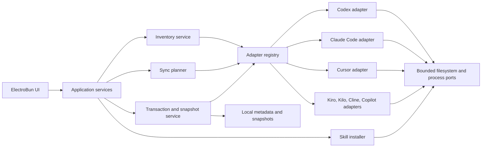
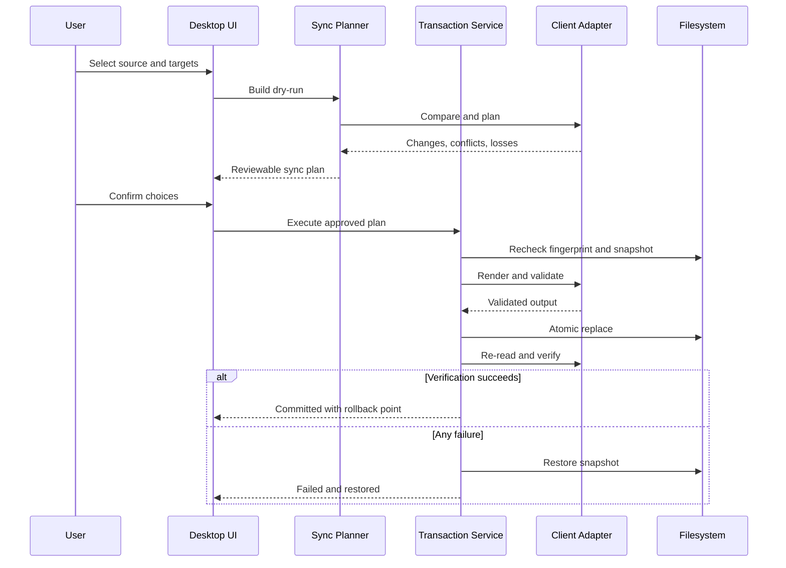

# AgentMindStudio — Proposed Technical Baseline

**Baseline date:** 2026-07-15  
**Implemented state:** None. The repository was indexed on this date and contained only the project root. Everything below is proposed, not implemented.

## 1. Architecture objective

Keep client-specific knowledge at the boundary. The core application should reason about normalized assets, scopes, compatibility, plans, and transactions without knowing whether the target file is JSONC, TOML, YAML, Markdown, or a directory tree.



## 2. Proposed component boundaries

### Desktop shell and UI

Responsibilities:

- Window lifecycle, navigation, native dialogs, and update UI.
- Dashboard, inventory, client detail, diff, sync plan, history, restore, and settings screens.
- No direct filesystem mutation from presentation components.

### Application services

Responsibilities:

- Orchestrate use cases and authorization prompts.
- Convert adapter outputs into UI view models.
- Enforce read-only mode and confirmation requirements.

### Adapter registry

Responsibilities:

- Select an adapter by client identity and version.
- Declare read/write capabilities per artifact type and scope.
- Expose verification range and migration rules.
- Prevent an unverified adapter from writing by default.

### Inventory service

Responsibilities:

- Detect installations and configuration roots.
- Parse layers without mutating them.
- Normalize artifacts and compute logical identity candidates.
- Report shadowing, malformed sources, duplicate bindings, and unsupported fields.

### Sync planner

Responsibilities:

- Compare one logical asset with target bindings.
- Ask adapters for conversions and validation.
- Produce field-level operations, warnings, conflicts, and restart requirements.
- Produce no side effects.

### Transaction and snapshot service

Responsibilities:

- Re-check fingerprints immediately before write.
- Acquire locks where possible.
- Snapshot every affected source.
- Write temporary outputs, validate, and atomically replace.
- Re-read through adapters and restore on failure.

### Skill installer

Responsibilities:

- Resolve source metadata.
- Stage downloads outside active client directories.
- Inspect content and risks.
- Invoke `npx skills` or another selected backend through a stable interface.
- Promote verified content to the selected destination transactionally.

### Metadata and snapshot store

Proposed split:

- SQLite for client records, logical identities, bindings, fingerprints, plans, operations, and audit events.
- Filesystem snapshot directory for original bytes and directory archives.
- Secret values excluded from both unless a future dedicated secure-store feature is approved.

## 3. Proposed adapter contract

An adapter should provide behavior equivalent to:

```text
identity(): ClientDescriptor
detect(context): ClientInstallation[]
discoverLayers(installation): ConfigLayer[]
capabilities(version): CapabilityMatrix
readLayer(layer): ParsedLayer
normalize(parsedLayer): Artifact[]
compare(logicalAsset, target): CompatibilityResult
planWrite(logicalAsset, target, choices): PlannedChange[]
render(plannedChanges, originalBytes): RenderedOutput
validate(renderedOutput, target): ValidationResult
postWriteCheck(target): VerificationResult
reloadGuidance(target): ReloadInstruction
```

Required guarantees:

- `readLayer`, `normalize`, `compare`, and `planWrite` are side-effect free.
- `render` preserves unknown fields and source formatting when the parser supports it.
- Every write capability is explicit by artifact type, scope, and client version.
- Adapter errors are structured; raw secret-bearing source is not included in generic logs.

## 4. Proposed normalized model

### ClientInstallation

- `id`
- `clientKind`
- `displayName`
- `version`
- `versionSource`
- `installationPath`
- `status`
- `adapterId`
- `adapterVerificationRange`

### ConfigLayer

- `id`
- `clientInstallationId`
- `scope`: managed, user, project-shared, project-local, runtime, plugin
- `artifactKinds`
- `path`
- `format`
- `precedence`
- `writable`
- `ownership`
- `fingerprint`
- `parseStatus`

### LogicalAsset

- `id`
- `kind`: mcp-server, skill, instruction
- `canonicalName`
- `portableFields`
- `clientExtensions`
- `provenance`
- `profileMembership`

### ArtifactBinding

- `logicalAssetId`
- `clientInstallationId`
- `configLayerId`
- `nativeIdentity`
- `nativeFields`
- `effectiveState`
- `compatibilityState`
- `lastObservedFingerprint`

### SyncPlan

- `id`
- `sourceBindingId`
- `targets`
- `operations`
- `conflicts`
- `losses`
- `secretDependencies`
- `preconditions`
- `createdAt`
- `status`

### AuditOperation

- `id`
- `planId`
- `adapterVersions`
- `affectedPaths`
- `beforeHashes`
- `afterHashes`
- `snapshotId`
- `result`
- `warnings`
- `timestamp`

## 5. Compatibility model

Every source-target pair should produce one of these states:

| State | Meaning | Write behavior |
|---|---|---|
| Exact | Portable and target semantics match. | Normal confirmation. |
| Convertible | A deterministic, non-lossy conversion exists. | Show generated representation. |
| Partial | Some behavior or fields cannot be represented. | Strong warning and explicit field choices. |
| Unsupported | Target adapter cannot represent the artifact. | No write. |
| Blocked | Policy, permissions, version, malformed source, or secret prerequisites prevent safe write. | No write until resolved. |

Compatibility is computed from behavior, not only filenames or schema keys.

## 6. Mutation sequence



## 7. Filesystem and process safety

- Resolve and normalize absolute paths before access.
- Require every write target to remain under an adapter-declared root or a user-approved custom root.
- Refuse traversal outside staging/target roots.
- Inspect symlinks and junctions before recursive operations.
- Use literal arguments, not shell-composed command strings.
- Set explicit working directories, timeouts, output limits, and cancellation behavior.
- Redact environment values and known secret patterns before persistence or display.
- Separate “connection test” from “save configuration”; neither implies the other.

## 8. Suggested repository layout

This layout is illustrative and should be adapted to ElectroBun's actual project conventions during scaffolding:

```text
AgentMindStudio/
  apps/
    desktop/
      ui/
      native/
  packages/
    domain/
    application/
    adapters/
      codex/
      claude-code/
      cursor/
      kiro/
      kilo/
      cline/
      copilot/
    config-formats/
    transaction/
    skill-installer/
    persistence/
  fixtures/
    clients/
  tests/
    compatibility/
    roundtrip/
    failure-injection/
  docs/
    baseline/
```

## 9. Required test strategy

### Adapter golden tests

- Parse sanitized real-world fixtures.
- Normalize expected artifacts.
- Render after targeted changes.
- Compare bytes or semantic output while asserting unknown-field and comment preservation.

### Round-trip tests

- Read, normalize, render without changes, and confirm no unintended diff.
- Apply one supported change and confirm only expected bytes/fields differ.

### Compatibility tests

- Test exact, convertible, partial, unsupported, and blocked examples for every adapter pair in scope.

### Failure-injection tests

- File locked after planning.
- Fingerprint changes before commit.
- Disk full or permission denied during temporary write.
- Process crash between files in a multi-file operation.
- Post-write client validation fails.
- Rollback itself encounters a recoverable error.

### Security tests

- Traversal, symlink, and junction escape attempts.
- Malicious filenames and oversized files.
- Secret values in nested keys, arguments, headers, and logs.
- Package source containing scripts or deceptive manifests.
- Command injection through name, path, arguments, or environment declarations.

## 10. Do not implement as shortcuts

- Do not scan the entire user profile recursively.
- Do not deserialize and rewrite a whole configuration file to change one unrelated field without a preservation strategy.
- Do not infer writability from filesystem permissions alone.
- Do not use file paths as the only artifact identity.
- Do not store resolved secrets in the normalized database.
- Do not let the UI call arbitrary shell commands.
- Do not automatically mirror every external file watcher event.
- Do not label an adapter “supported” until restore and round-trip tests pass.
