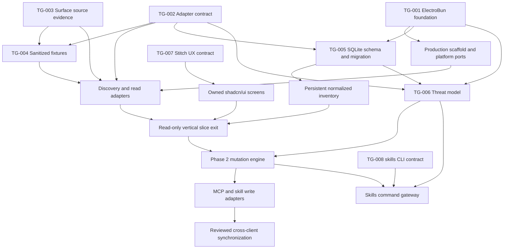

# AgentMindStudio — Technical Readiness Gates

**Baseline date:** 2026-07-15  
**Purpose:** Canonical self-tracking register for technical evidence required before implementation crosses a safety or architecture boundary.  
**Authority:** Product intent comes from the [Project Nexus](../../nexus/README.md); this register owns technical-gate status for the AgentMindStudio baseline pack.

## 1. Tracking rules

This file is the single source of truth for gate status. Roadmap, ADR, spike, and code documents may reference a gate ID but must not maintain a competing status.

Allowed states:

| State | Meaning |
|---|---|
| `planned` | Required work is defined but has not started. |
| `in_progress` | An owner is actively producing the required artifacts or evidence. |
| `blocked` | Progress requires an explicit dependency, user decision, or external change. |
| `passed` | Every pass condition is met and linked evidence exists. |
| `failed` | Evidence disproved the expected technical direction; open an ADR or product decision before continuing. |
| `superseded` | Another gate or approved direction replaced this gate; link the replacement. |

Gate update protocol:

1. Set `in_progress`, owner, and review date before beginning work.
2. Create artifacts only in the locations declared by the gate, or update the gate before using another location.
3. Record exact environment, dependency versions, fixtures, commands, and limitations in spike evidence.
4. Mark `passed` only when all pass conditions are satisfied and evidence links resolve.
5. Reopen a passed gate when its listed invalidation trigger occurs.
6. If a gate fails, stop the blocked implementation path; record the result and create the necessary ADR or Nexus OpenDecision.

## 2. Gate dashboard

| Gate | Technical question | Status | Owner | Blocks | Dependencies | Evidence |
|---|---|---|---|---|---|---|
| TG-001 | Can ElectroBun safely provide the required Windows filesystem, process, SQLite, and packaging primitives? | `passed` | Codex | Production scaffold and platform-port commitment | None | [Spike](../../spikes/electrobun-foundation/2026-07-15-electrobun-1.18.1-windows.md), [passing report](../../spikes/electrobun-foundation/runs/20260715-174500/results.json) |
| TG-002 | Is the adapter and capability contract precise enough for independent client adapters? | `passed` | Codex | Client-specific read/write adapter implementation | Nexus domain model | [ADR-0001](../../adr/ADR-0001-adapter-capability-contract.md), [contract proof](../../spikes/adapter-contract/README.md), [passing report](../../spikes/adapter-contract/runs/20260716-011900/results.json) |
| TG-003 | Are global sources, formats, ownership, precedence, and reload behavior verified for every MVP surface? | `passed` | Codex | Discovery rules and fixture completion | None | [Evidence pack](../../spikes/client-surface-config/README.md), [surface-artifact matrix](../../spikes/client-surface-config/surface-artifact-matrix.json), [sanitized local report](../../spikes/client-surface-config/runs/20260716-ams-windows/results.json) |
| TG-004 | Do sanitized fixtures cover every supported read shape and preservation risk? | `passed` | Codex | Parser support claims, read adapters, and round-trip tests | TG-002, TG-003 | [Fixture pack](../../../fixtures/clients/), [passing verification and secret scan](../../../fixtures/clients/verification-results.json) |
| TG-005 | Does the first SQLite schema represent identities, bindings, observations, plans, audit, and recovery without storing secrets? | `planned` | Unassigned | Persistence-backed inventory and operation journal | TG-002; scaffold from TG-001 | Planned: `docs/adr/ADR-0002-sqlite-metadata-schema.md` and migration `0001` |
| TG-006 | Are filesystem, package, process, MCP, symlink, snapshot, log, and export threats understood and mitigated? | `planned` | Unassigned | Phase 2 mutation and every mutating skills workflow | TG-001, TG-002, TG-005 | Planned: `agentmindstudio.threat-model.md` |
| TG-007 | Are navigation, Coverage, Diff, Apply, error, and read-only Instruction flows approved before production UI work? | `planned` | Unassigned | Production implementation of the corresponding UI flows | Closed product decisions | Planned: `docs/spikes/ui-exploration/` |
| TG-008 | Is the pinned skills CLI behavior compatible with the guarded process gateway? | `passed` | Codex | `SkillCommandGateway` implementation for `skills@1.5.17` | None | [Spike](../../spikes/skills-cli/2026-07-15-skills-cli-1.5.17.md), [passing report](../../spikes/skills-cli/runs/20260715-134100/results.json) |

## 3. Current readiness

| Boundary | Readiness | Required gates |
|---|---|---|
| Start technical spikes and ADR work | `ready` | Product decisions are closed. |
| Commit to the ElectroBun production scaffold | `ready` | TG-001 passed with documented packaging/lifecycle limitations. |
| Implement client-specific read adapters | `ready` | TG-002, TG-003, and TG-004 passed; write capabilities remain unauthorized. |
| Persist normalized inventory in SQLite | `not ready` | TG-005 |
| Implement production Dashboard/Coverage/Diff flows | `not ready` | TG-007 plus the relevant read services |
| Enter Phase 2 mutation engine | `not ready` | Read-only foundation exit plus TG-006 |
| Implement mutating skills workflows | `not ready` | TG-006 and mutation safeguards; TG-008 is already passed for the current pin |
| Implement MCP/skill write adapters and synchronization | `not ready` | Phase 2 exit plus adapter-specific write fixtures |

## 4. Canonical dependency plan



### Execution waves

1. **Wave 0 — Parallel evidence:** TG-001 through TG-004 are passed. Continue TG-007 according to the dashboard's current status. Do not rerun a passed gate unless an invalidation trigger occurs.
2. **Wave 1 — Read-only foundation:** create the scaffold and platform ports, complete TG-005, then implement discovery/read adapters against the passed TG-004 fixture contract, persistent inventory, and the approved shadcn/ui read flows.
3. **Wave 2 — Mutation safety:** complete TG-006 and the read-only vertical slice, then implement snapshots, fingerprints, transaction state, atomic writes, verification, and recovery.
4. **Wave 3 — Writable capabilities:** implement MCP/skill write adapters and reviewed synchronization. Implement mutating skills workflows only with TG-008 plus Phase 2 safeguards.

Instruction/rule behavior remains read-only through every MVP wave.

## 5. Gate contracts

### TG-001 — ElectroBun foundation spike

Required artifacts:

- Spike report under `docs/spikes/electrobun-foundation/` with exact ElectroBun, Bun, Windows, and SQLite versions.
- Minimal disposable prototype or repeatable scripts used by the spike.
- Recommendation: direct implementation, native helper, or framework reconsideration.

Required verification:

- Bounded file read/write in paths containing spaces and Unicode.
- Temporary write plus atomic replacement, lock/error behavior, and cleanup.
- Argument-array child process execution with separate stdout/stderr, timeout, cancellation, exit code, and sanitized environment.
- SQLite open, migration, transaction rollback, close/reopen, and failure behavior.
- Packaged Windows build performing the same operations without elevation.

Pass condition: every required primitive works in a packaged build, or an explicitly approved platform-port fallback covers the gap without changing Nexus scope.

Invalidation: ElectroBun/Bun major upgrade, packaging/runtime replacement, or a newly required native primitive.

### TG-002 — Adapter and capability contract

Required artifacts:

- `docs/adr/ADR-0001-adapter-capability-contract.md`.
- Versioned TypeScript contract or compileable spike interface.
- Capability schema covering harness, surface, artifact, scope, read, write, test, reload, preservation, and version confidence.
- Structured adapter error taxonomy with no raw secret-bearing source in generic errors.

Required verification:

- Codex and Kilo proof adapters compile against the same contract without core conditionals.
- Discovery/read/normalize/compare methods are side-effect free.
- Write capabilities are explicit per surface, artifact, scope, and verified schema.
- Instruction capabilities are read-only for MVP.

Pass condition: ADR accepted, contracts compile, and the two proof adapters demonstrate extension to the other MVP surfaces without changing the core model.

Invalidation: a new MVP artifact or surface cannot be represented without breaking the contract.

### TG-003 — Surface source and precedence verification

Required artifacts:

- One evidence record per MVP surface under `docs/spikes/client-surface-config/`.
- Updated [client surface matrix](../../nexus/client-surface-matrix.md).
- A machine-readable or tabular matrix for each surface × MCP/Skill/Instruction combination.

Each record must identify:

- resolved user/global path or discovery rule;
- format and schema/version signal;
- precedence, ownership, and writability;
- whether multiple surfaces share the resolved source;
- reload/restart behavior;
- official evidence plus sanitized local verification;
- unsupported or unknown fields.

Pass condition: Copilot CLI, Copilot VS Code, Codex, Kiro, and Kilo have evidence for every MVP artifact class, with unknowns explicitly classified rather than guessed.

Invalidation: client version changes a path, format, precedence rule, or supported capability.

### TG-004 — Sanitized fixture pack

Required artifacts:

- `fixtures/clients/<surface>/<artifact>/` fixture sets.
- A manifest containing provenance category, sanitization date, source version, expected parse state, and expected normalized output.
- Automated secret scan and redaction review result.

Minimum cases where the format supports them:

- empty/minimal source;
- representative valid source;
- malformed source;
- comments and formatting preservation;
- unknown client-specific fields;
- duplicate/shadowed definitions;
- same-name/different-endpoint MCP conflict;
- different-name/same-endpoint alias;
- per-client credential-binding difference;
- read-only instruction activation/precedence variants.

Pass condition: every read capability has positive and failure fixtures, no real secret remains, expected normalized outputs exist, and golden tests can consume the pack.

Invalidation: adapter support expands to a new schema, path, surface, or artifact behavior.

### TG-005 — SQLite metadata schema and first migration

Required artifacts:

- `docs/adr/ADR-0002-sqlite-metadata-schema.md` with ERD and trade-offs.
- Migration `0001` plus migration smoke tests.
- Documented operation-state and crash-recovery transitions.

The schema must cover:

- harness installations, surfaces, sources, and layers;
- logical assets, aliases, bindings, observations, and content fingerprints;
- capability/schema evidence and intentional-difference state;
- sync plans, operations, affected paths, hashes, results, and snapshot indexes;
- schema version and migration history;
- reference checks required before shared-content deletion.

Pass condition: a clean database migrates, closes, reopens, preserves representative fixture metadata, rolls back a failed transaction, and contains no raw credential values or snapshot content.

Invalidation: normalized identity, audit, recovery, or profile requirements cannot be represented without unsafe ad hoc storage.

### TG-006 — Security threat model

Required artifacts:

- `agentmindstudio.threat-model.md` in this baseline pack.
- Trust-boundary diagram, threat register, mitigations, residual risks, and security test mapping.

Required scope:

- bounded filesystem reads/writes, traversal, symlinks, junctions, and locks;
- downloaded skill repositories, executable content, and supply-chain provenance;
- child processes, arguments, environment, timeouts, cancellation, and output limits;
- MCP command/network tests and secret dependencies;
- SQLite metadata, filesystem snapshots, logs, diagnostics, and exports;
- rollback failure, partial operations, and external file changes.

Pass condition: no unresolved critical/high risk blocks the intended operation; every accepted material risk has an owner, rationale, mitigation, and verification test.

Invalidation: a new mutating capability, external execution boundary, secret-storage feature, or distribution channel is introduced.

### TG-007 — Stitch UX contract

Required artifacts:

- Exploration record and accepted screenshots/exports under `docs/spikes/ui-exploration/`.
- Flow-level acceptance notes and a shadcn/ui component mapping.
- Accessibility review for keyboard navigation, focus order, non-color state indicators, and redacted values.

Required flows:

- first-run discovery and surface/layer health;
- unified inventory and Coverage matrix;
- same-name/different-endpoint conflict;
- different-name/same-endpoint alias linking;
- raw plus semantic Diff;
- Apply drawer with exact paths, preserved credentials, snapshot, and rollback;
- skills CLI incompatibility/error state;
- read-only Instruction comparison with no mutation affordance.

Pass condition: accepted prototypes cover every required flow, decisions are recorded, and each production screen maps to owned shadcn/ui components rather than generated source ownership.

Invalidation: a product flow, navigation model, or core interaction invariant changes.

### TG-008 — Pinned skills CLI compatibility

Current pin: `skills@1.5.17`.

Current evidence:

- [Integration spike](../../spikes/skills-cli/2026-07-15-skills-cli-1.5.17.md)
- [Passing timeout-guarded report](../../spikes/skills-cli/runs/20260715-134100/results.json)
- [Repeatable project-scoped skill](../../../.agents/skills/spike-skills-cli/SKILL.md)

Pass condition: exact version, command discovery, JSON inventory, local discovery, isolated install/use/remove, timeout handling, and known non-zero/zero-exit anomalies match the guarded contract.

Invalidation: package pin, invocation method, expected output shape, supported command set, Node/npm runtime, or gateway contract changes.

### TG-001 completion — 2026-07-15

Gate: TG-001  
Previous state: `planned`  
New state: `passed`  
Reviewed at: 2026-07-15 17:07 Asia/Saigon  
Owner: Codex  
Environment/versions: Windows 11 Pro 10.0.22631 build 22631 AMD64; ElectroBun 1.18.1; Bun 1.3.13; SQLite 3.51.2  
Artifacts: [`docs/spikes/electrobun-foundation/`](../../spikes/electrobun-foundation/)  
Verification evidence: [Spike report](../../spikes/electrobun-foundation/2026-07-15-electrobun-1.18.1-windows.md) and [passing machine report](../../spikes/electrobun-foundation/runs/20260715-174500/results.json)  
Limitations: stable packaging requires a process-local execution-policy workaround for `Compress-Archive`; the headless packaged launcher required runner termination after the probe completed; installer execution/signing and UI lifecycle were outside scope.  
Invalidation triggers confirmed: ElectroBun/Bun major upgrade, packaging/runtime replacement, newly required native primitive, or changed release-build policy/module environment.  
Affected roadmap/sourcecode sections: roadmap first action now proceeds to TG-002; the technical baseline now records TG-001 evidence while keeping all production components proposed.

### TG-002 completion — 2026-07-16

Gate: TG-002  
Previous state: `planned`  
New state: `passed`  
Reviewed at: 2026-07-16 01:18 Asia/Saigon  
Owner: Codex  
Environment/versions: Windows NT 10.0.22631 AMD64; Node.js 24.13.1; TypeScript 6.0.2; adapter contract 1.0.0  
Artifacts: [ADR-0001](../../adr/ADR-0001-adapter-capability-contract.md) and [`docs/spikes/adapter-contract/`](../../spikes/adapter-contract/)  
Verification evidence: [Passing strict-compile and contract-proof report](../../spikes/adapter-contract/runs/20260716-011900/results.json)  
Limitations: proof adapters use synthetic, secret-free native shapes; they establish the interface and capability invariants but do not themselves verify production client paths, precedence, parser round trips, or write preservation. TG-003/TG-004 evidence is tracked separately below. TypeScript cannot prevent ambient side effects, so adapter purity remains a review and deterministic-test invariant.  
Invalidation triggers confirmed: reopen when an MVP artifact or surface cannot be represented without breaking contract 1.0.0.  
Affected roadmap/sourcecode sections: roadmap first action proceeds to TG-003; the technical baseline now references the accepted contract and keeps all production adapters proposed.

### TG-003 completion — 2026-07-16

Gate: TG-003  
Previous state: `in_progress`  
New state: `passed`  
Reviewed at: 2026-07-16 02:25 Asia/Saigon  
Owner: Codex  
Environment/versions: Windows NT 10.0.22631 X64; PowerShell 7.5.4; Codex CLI 0.125.0; Kiro CLI 2.8.0; Kilo CLI 7.3.21; Kilo VS Code 7.4.7; VS Code 1.128.1; Copilot CLI and Copilot VS Code extension absent  
Artifacts: [`docs/spikes/client-surface-config/`](../../spikes/client-surface-config/) and updated [client surface matrix](../../nexus/client-surface-matrix.md)  
Verification evidence: [15-row surface-artifact matrix](../../spikes/client-surface-config/surface-artifact-matrix.json) and [metadata-only local report](../../spikes/client-surface-config/runs/20260716-ams-windows/results.json)  
Limitations: local verification reads metadata only and does not expose config bytes, child names, resolved user paths, or auth state. Copilot behavior is based on current official documentation because neither Copilot surface was installed. Same-name precedence remains explicitly unknown where official documentation does not define it. No write capability is authorized.  
Invalidation triggers confirmed: reopen when a client version changes a documented path, format, precedence rule, reload behavior, shared-source relationship, or supported capability.  
Affected roadmap/sourcecode sections: the next production boundary is discovery/read adapters against TG-002 through TG-004; production implementation remains absent.

### TG-004 completion — 2026-07-16

Gate: TG-004  
Previous state: `planned`  
New state: `passed`  
Reviewed at: 2026-07-16 02:25 Asia/Saigon  
Owner: Codex  
Environment/versions: fixture schema 1; PowerShell 7.5.4 verifier; source-version and provenance category recorded per manifest  
Artifacts: [`fixtures/clients/`](../../../fixtures/clients/) with one manifest and expected normalized output per 15 supported read rows  
Verification evidence: [passing manifest, scenario, expected-output, and secret-scan report](../../../fixtures/clients/verification-results.json)  
Limitations: fixtures authorize parser/read implementation only. They do not prove production parsers, byte-for-byte round trips, comment/unknown-field writes, active-client reload, or mutation preservation. Copilot fixtures are official-example-derived because the surfaces were absent locally.  
Invalidation triggers confirmed: reopen when adapter read support expands to a new schema, path, surface, artifact behavior, or activation mode.  
Affected roadmap/sourcecode sections: read-adapter implementation is now ready; all write adapters and instruction mutations remain blocked or out of scope.

## 6. Gate completion record template

Append a completion entry when a gate changes to `passed`, `failed`, or `superseded`:

```text
Gate:
Previous state:
New state:
Reviewed at:
Owner:
Environment/versions:
Artifacts:
Verification evidence:
Limitations:
Invalidation triggers confirmed:
Affected roadmap/sourcecode sections:
```
