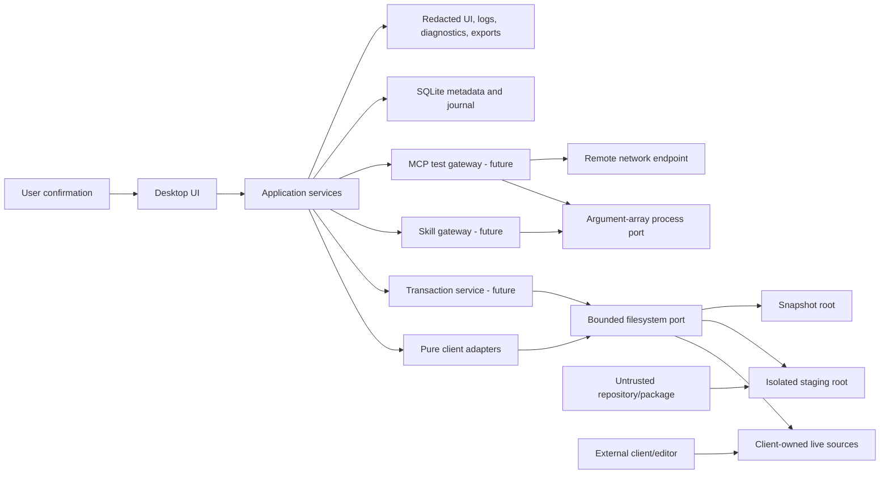

# AgentMindStudio — Security Threat Model

**Gate:** TG-006  
**Review date:** 2026-07-16  
**Scope:** Windows-first MVP, global/user client configuration, read-only foundation, planned mutation engine, skills gateway, MCP tests, diagnostics, snapshots, and exports  
**Authority:** [Project Nexus](../../nexus/README.md), [architecture principles](../../nexus/architecture-principles.md), and the canonical [technical-gate register](agentmindstudio.technical-gates.md)

## 1. Gate conclusion

TG-006 is satisfied for the current architecture boundary.

- Current filesystem, process, SQLite, migration, operation-journal, fixture, and shared-content controls have executable verification.
- No production write, snapshot, skill-install, MCP connection-test, diagnostics-export, or bundle-export capability exists yet.
- Risks at those future boundaries are controlled by capability prohibition: implementation must not become supported until the mapped security tests pass.
- No Critical or High risk remains both exposed and unresolved. Accepted residual risks are Medium or Low, have an owner, and retain explicit verification requirements.

Passing TG-006 approves the threat/control contract. It does not claim that the Phase 2 mutation engine is implemented or that the read-only vertical slice has exited. A new mutating capability or external execution boundary reopens this gate before release.

## 2. Security objectives and assets

Security objectives:

1. Read and write only explicitly resolved user/global sources.
2. Never execute configuration text, downloaded content, or UI-provided shell strings implicitly.
3. Preserve client-owned bytes, credentials, precedence semantics, and recoverability across explicit operations.
4. Keep raw secrets out of SQLite, logs, diagnostics, exports, and generic errors.
5. Bound filesystem, process, network, and parsing resource consumption.
6. Make partial failure and external interference visible instead of silently continuing.

Protected assets:

- live client configuration and installed skill content;
- credential bindings and secret-bearing environment/header values;
- filesystem snapshots and operation hashes;
- SQLite identity, observation, plan, audit, and recovery metadata;
- downloaded repositories and staged package content;
- child-process arguments, environment, output, and exit state;
- diagnostics, clipboard data, issue reports, and future exports.

## 3. Trust boundaries



Boundary rules:

- UI and adapters receive no arbitrary filesystem or process authority.
- Adapters transform immutable snapshots and candidate bytes; application services own effects.
- Live client files are authoritative and may change independently at any time.
- Repository/package content, MCP commands, remote endpoints, and client-native strings are untrusted.
- SQLite is trusted only for classified metadata, not source bytes, snapshot bytes, credentials, or arbitrary process output.

## 4. Severity and disposition

| Severity | Meaning | Gate rule |
|---|---|---|
| Critical | Credible arbitrary execution, broad secret disclosure, or irreversible multi-source destruction | Capability remains unavailable until verified mitigation exists. |
| High | Credible source escape, targeted secret disclosure, unrecoverable write, or persistent integrity loss | Must be mitigated and tested, or unavailable behind an explicit entry gate. |
| Medium | Bounded local impact, same-user race, recoverable denial of service, or sanitizer false negative | May be accepted with owner, rationale, control, and verification requirement. |
| Low | Limited observability/usability impact with existing containment | Track and regression-test where practical. |

`Gated` below means the risky capability is absent from production code and its listed tests are mandatory before implementation can be called supported.

## 5. Threat register

| ID | Boundary and threat | Initial | Current controls and disposition | Verification | Residual | Owner |
|---|---|---:|---|---|---:|---|
| FS-001 | `..`, absolute path, or alternate-root traversal escapes a declared root | High | Lexical containment rejects escape paths. Reads additionally resolve the existing target before opening it. | SEC-001 | Low | Platform owner |
| FS-002 | Symlink or junction inside a valid root redirects a read outside that root | High | Existing read targets use real-path containment; Windows junction escape is tested. Recursive mutation is unavailable. | SEC-002 | Medium | Platform owner |
| FS-003 | Oversized config, skill, or instruction exhausts memory | High | Text reads require a positive per-call byte limit and enforce a 16 MiB hard ceiling without reading the entire file. | SEC-003 | Low | Adapter owner |
| FS-004 | Link swap, file replacement, or external edit occurs after planning/checking | Critical | Mutation is unavailable. Phase 2 requires locks where possible, pre-write fingerprint recheck, same-root temporary file, atomic replacement, and post-write reparse. | FUT-001 | Gated | Transaction owner |
| FS-005 | Recursive cleanup or uninstall follows a reparse point or deletes shared content | Critical | Recursive production deletion is unavailable. SQLite blocks retained shared-content deletion; future cleanup is limited to verified staging/snapshot roots and literal targets. | SEC-008, FUT-001 | Gated | Transaction owner |
| PKG-001 | Downloaded repository/package contains malicious scripts, deceptive files, or changed provenance | Critical | Skill gateway is unavailable. Required flow pins the CLI, stages outside active roots, records source/revision/checksum, previews files, and never executes bundled skill content merely by install. | FUT-003 | Gated | Skill-gateway owner |
| PKG-002 | Downloaded symlinks/junctions escape staging or target roots | Critical | Skill mutation is unavailable; future staging must reject escaping reparse points before plan creation and again before apply. | FUT-003 | Gated | Skill-gateway owner |
| PROC-001 | User/client text becomes shell syntax or command injection | Critical | Process port accepts executable plus argument array and never composes a shell command string. UI has no arbitrary process API. | SEC-004 | Low | Platform owner |
| PROC-002 | Parent environment leaks tokens to a child process | High | Child environment starts from an explicit request and adds only required Windows runtime keys. Undeclared sentinel values are verified absent. | SEC-004 | Low | Platform owner |
| PROC-003 | Child hangs, ignores cancellation, or emits unbounded output | High | Positive timeout and per-stream output limits are mandatory; cancellation and limit breaches terminate the child. | SEC-005 | Low | Platform owner |
| MCP-001 | Local MCP test executes an unreviewed command | Critical | No MCP execution gateway exists. Future tests require exact command/arguments preview, explicit user action, bounded environment, working directory, timeout, output limit, and stable result codes. Saving configuration never implies testing it. | FUT-004 | Gated | MCP-gateway owner |
| MCP-002 | Remote MCP test enables SSRF, secret exfiltration, redirect abuse, or unbounded response | Critical | No network test implementation exists. Future implementation requires explicit endpoint review, scheme/redirect policy, timeout/size limits, no automatic credential reuse, and redacted results. | FUT-004 | Gated | MCP-gateway owner |
| DATA-001 | Raw credentials or snapshot content enter SQLite | High | Strict metadata schema stores credential presence/category and snapshot indexes only; schema tests reject raw credential/snapshot-content columns. | SEC-006 | Low | Persistence owner |
| DATA-002 | Migration drift or partial migration corrupts the metadata store | High | Ordered migrations run transactionally and applied SQL is checked by SHA-256; mismatch stops startup. | SEC-007 | Low | Persistence owner |
| SNAP-001 | Snapshot bytes disclose secrets or are restored to the wrong path | High | Snapshot writing is unavailable. Future store uses an application-owned root, opaque operation index, restrictive permissions where supported, exact target mapping, hashes, and verified restore. Snapshot bytes never enter diagnostics or exports by default. | FUT-002 | Gated | Transaction owner |
| LOG-001 | Raw source, arguments, headers, environment, or process output leaks through logs/errors | High | Adapter contract uses structured secret-safe errors; current tests use sanitized fixtures; diagnostics/export features are unavailable until a central redactor and adversarial tests exist. | SEC-009, FUT-005 | Medium | Security owner |
| EXP-001 | Diagnostics or bundle export includes secret/source/snapshot bytes | Critical | Diagnostics content export and portable bundle export are unavailable. Future export is metadata-only by default and must block on detected plaintext secrets. | FUT-005 | Gated | Security owner |
| TX-001 | Stale plan overwrites an external edit | Critical | Mutation is unavailable. Phase 2 requires planned hashes, immediate fingerprint recheck, abort/rescan on mismatch, then post-write verification. | FUT-001 | Gated | Transaction owner |
| TX-002 | Crash or rollback failure leaves a partial multi-file operation | High | Operation journal and interrupted-state classification exist; write/snapshot/recovery execution remains unavailable until failure-injection tests prove exact or explicitly partial recovery. | SEC-009, FUT-006 | Gated | Transaction owner |
| DEL-001 | Shared installed skill content is removed while another binding retains it | High | Foreign-key restrictions, retained-reference trigger, and deletion-check view block removal. | SEC-008 | Low | Persistence owner |

## 6. Security control contracts

### 6.1 Filesystem and mutation

- Resolve lexical paths beneath an adapter-declared or explicitly approved root.
- For existing reads, compare real paths before opening and reject reparse-point escape.
- Require an explicit byte limit for every text read; parsers add lower artifact-specific limits where appropriate.
- Never infer writability from permissions alone; require adapter capability and schema/preservation evidence.
- Mutation order remains: plan, review, snapshot, fingerprint recheck, lock where possible, same-directory temporary write, flush, atomic replace, reparse, audit, recover.
- Recursive delete is restricted to application-created staging/snapshot children whose resolved parent and identity are verified immediately before deletion.

The existing real-path check reduces accidental and static reparse escape. It cannot eliminate a hostile same-user link-swap race between check and open. This is accepted as Medium for read-only discovery. Mutation must add FUT-001 protections and may require a platform-specific handle/identity check before the first write capability is supported.

### 6.2 Downloaded skills and packages

- Treat repository/package content as untrusted code acquisition.
- Fetch only into a new application-owned staging directory.
- Pin the `skills@1.5.17` gateway contract and record source, resolved revision, and content checksums.
- Preview manifests, full file list, executable/script indicators, and reparse points.
- Do not run package lifecycle scripts or bundled skill scripts as an installation side effect.
- Convert verified staging output into a separately reviewed target plan; never point the CLI directly at active client roots for a production mutation.

### 6.3 Processes and MCP tests

- Use executable/argument arrays, explicit working directory, explicit environment, timeout, cancellation, and per-stream output bounds.
- Treat stdout, stderr, exit code, and even successful zero exit as untrusted until the expected semantic contract is validated.
- Separate “test connection” from “save configuration.” Neither operation implies the other.
- Remote MCP tests do not automatically reuse discovered credentials; the user selects a declared credential dependency explicitly.
- Persist only stable result/error codes and redacted metadata, never arbitrary process/network payloads.

### 6.4 SQLite, snapshots, logs, and exports

- SQLite stores classified metadata and hashes only. Live source and snapshot bytes remain on the filesystem.
- Snapshot content uses an application-owned root and is excluded from normal diagnostics, clipboard, and export paths.
- Error/log APIs accept stable codes plus pre-redacted fields. Raw exceptions are developer-only transient data and are not persisted by default.
- Diagnostics default to topology, versions, capability states, safe error codes, and hashes; configuration content is excluded.
- Export is fail-closed when secret scanning or provenance verification cannot complete.

### 6.5 Rollback, partial operations, and external changes

- A plan is valid only for the exact observed source hashes it contains.
- Every affected path is snapshotted and indexed before the first write.
- Multi-file operations record per-path progress; interruption becomes `recovery_required`.
- Recovery reports `recovered` or `partial_recovery` explicitly and retains the audit record.
- Rollback is itself fingerprint-checked, reparsed, verified, and audited.

## 7. Security test mapping

| Test ID | Threats | Evidence | Current result |
|---|---|---|---|
| SEC-001 | FS-001 | `tests/platform/windows-platform.test.ts` lexical traversal and Unicode-root read | Passed |
| SEC-002 | FS-002 | `tests/security/security-boundaries.test.ts` Windows junction escape | Passed |
| SEC-003 | FS-003 | `tests/security/security-boundaries.test.ts` bounded text read | Passed |
| SEC-004 | PROC-001, PROC-002 | Platform/security tests for argument preservation, separate streams, and non-inherited secret environment | Passed |
| SEC-005 | PROC-003 | Security tests for timeout, cancellation, and output-limit termination | Passed |
| SEC-006 | DATA-001 | `tests/persistence/migration.test.ts` secret/snapshot-content schema exclusion | Passed |
| SEC-007 | DATA-002 | Migration idempotence, checksum, rollback, close/reopen, and packaged migration verification | Passed |
| SEC-008 | FS-005, DEL-001 | Retained shared-content deletion trigger/restriction test | Passed |
| SEC-009 | LOG-001, TX-002 | Adapter safe-error proof, operation transition tests, interrupted-state classification, and fixture secret scan | Passed for implemented boundary |
| FUT-001 | FS-004, FS-005, TX-001 | Reparse swap, lock, stale fingerprint, same-root atomic replace, and external-change injection suite | Required before first write |
| FUT-002 | SNAP-001 | Snapshot permission, path mapping, integrity, retention, wrong-target, and restore verification suite | Required before snapshot support |
| FUT-003 | PKG-001, PKG-002 | Malicious repository, lifecycle script, executable, deceptive manifest, and escaping link fixtures | Required before mutating skill workflow |
| FUT-004 | MCP-001, MCP-002 | Command injection, environment leak, SSRF/redirect, timeout, response limit, and credential-isolation tests | Required before MCP connection tests |
| FUT-005 | LOG-001, EXP-001 | Nested secret, argument/header/token, DOM/accessibility, clipboard, diagnostics, and export redaction tests | Required before diagnostics/content export |
| FUT-006 | TX-002 | Crash between files, disk full, permission loss, failed post-parse, and rollback-failure injection | Required before multi-file mutation |

Repeat current verification from the repository root:

```powershell
bun run check
bun run verify:security
bun run build
bun run verify:packaged
pwsh -NoProfile -File fixtures/clients/verify.ps1 -EvidencePath build/security-fixture-verification.json
```

## 8. Accepted residual risks

| Risk | Rationale | Mitigation and follow-up | Owner |
|---|---|---|---|
| Same-user link swap after real-path validation | Read-only discovery is not a privilege boundary; a local process running as the same user can race file identity. | Current reads are bounded and reject stable reparse escape. FUT-001 must add write-time identity/recheck controls before mutation. | Platform owner |
| Secret-classification false negatives | A secret can be embedded in an arbitrary string that no finite pattern set recognizes. | Default to metadata-only diagnostics, never normalize credential values, redact known structures, and require FUT-005 adversarial tests before export. | Security owner |
| Windows lock and atomicity differences across filesystems/tools | Client editors and security software can hold or replace files in implementation-specific ways. | Treat lock acquisition as advisory, fingerprint immediately before replace, fail closed, and verify with FUT-001/FUT-006 on the supported Windows matrix. | Transaction owner |

No accepted residual risk is Critical or High.

## 9. Capability entry conditions

- Read adapters may use the verified bounded read/process/persistence foundation and TG-004 fixtures.
- Phase 2 mutation implementation may begin only after the read-only vertical slice exits; every write remains unsupported until FUT-001, FUT-002, FUT-005, and FUT-006 pass for that operation.
- Mutating skills workflows additionally require FUT-003 and the still-valid TG-008 pin evidence.
- MCP connection tests additionally require FUT-004.
- Diagnostics with content and all exports require FUT-005.
- Instruction/rule mutation remains out of MVP regardless of TG-006 status.

## 10. Invalidation triggers

Reopen TG-006 when any of the following occurs:

- a new mutating capability or recursive filesystem operation is proposed;
- a new external process, package manager, repository host, network/MCP test, or execution boundary is introduced;
- secret values are proposed for storage or transport;
- diagnostics, clipboard, content export, profile bundle, signing, installer, or update channels are introduced;
- Windows/Bun/ElectroBun filesystem or process behavior changes materially;
- a Critical/High finding, bypass, failed mapped test, or unsupported recovery state is discovered.
